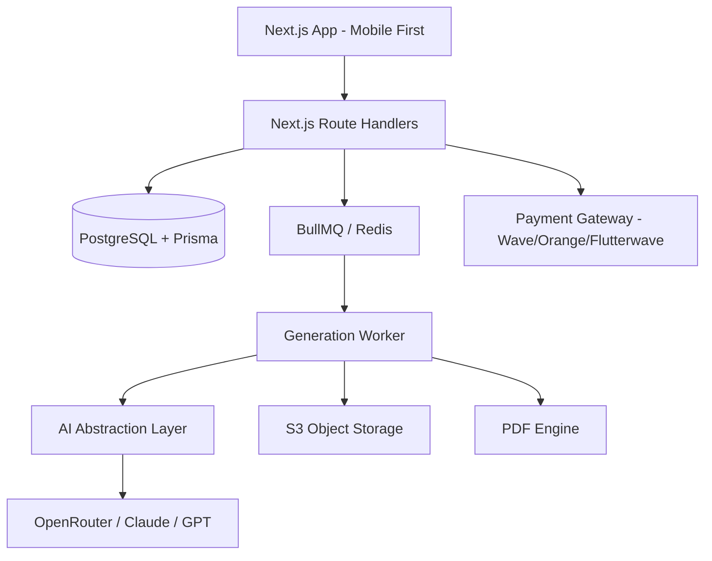

# Analyse Stratégique & Architecture - SaaS Digital Products Africa

## 1. Executive Summary
Le projet vise à créer un "Product Architect" IA pour entrepreneurs africains. Contrairement aux solutions génériques (ChatGPT/Canva), la valeur réside dans la **verticalisation géographique et sectorielle**, l'accès à des données de marché locales vérifiées et un workflow "End-to-End" (Recherche -> Création -> Marketing -> Export) optimisé pour le mobile et les paiements locaux (Mobile Money).

## 2. Critique du Business Model
- **Point Fort :** L'approche "Evidence-based" (données vérifiées vs hallucinations) est le seul moyen de gagner la confiance des experts.
- **Défi :** L'accès aux données temps-réel sur les marchés informels africains. Le système devra s'appuyer sur du scraping ciblé et des rapports d'institutions (BAD, banques centrales) plutôt que sur des datasets IA génériques.
- **Risque de Rétention :** Une fois le produit créé, l'utilisateur a-t-il besoin de revenir ? Solution : Intégrer la gestion des ventes ou des itérations produit (V2, V3) pour transformer l'outil de création en plateforme de croissance.

## 3. Target User
- **Profil :** Consultant ou infopreneur (Sénégal, Côte d'Ivoire, Nigeria, Kenya) possédant une expertise métier mais manquant de compétences en design/marketing/copywriting.
- **Besoin :** Transformer son savoir en un actif numérique vendable sans workflow complexe.

## 4. Proposition de Valeur
"Passez de l'idée au produit digital prêt à la vente en 30 minutes, avec des données de marché réelles et des visuels adaptés à votre audience locale."

## 5. MVP Recommandé
- Recherche d'opportunités (Niche scoring).
- Générateur d'Ebook/Guide (~3000 mots).
- Pack marketing (Landing page, Social Media assets).
- Ledger de crédits & Paiement Mobile Money.

## 6. Architecture Technique (Mermaid)

## 7. Modèle de Données (Extraits)
- **Market:** `id, country, currency, language, sectors`
- **Opportunity:** `id, marketId, score, demand, painLevel, evidence (JSON)`
- **Project:** `id, userId, status (Draft/Generating/Completed), creditsConsumed`
- **CreditTransaction:** `id, userId, amount, type (Debit/Credit), referenceId`
