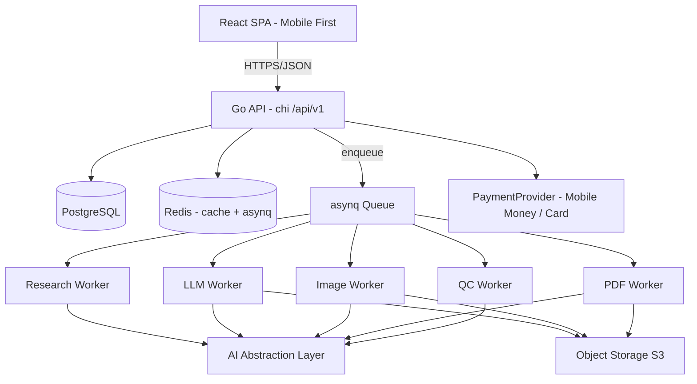

# Architecture — AfriLaunch

## 1. Vue d'ensemble

AfriLaunch est un SaaS composé de deux applications déployables indépendamment, dans un monorepo à deux dossiers (`backend/` + `frontend/`), plus des **workers** de génération asynchrone (même base Go que le backend).



## 2. Principes directeurs

1. **Product viability > architecture quality > feature richness** (priorité explicite du produit).
2. Toute génération longue est **asynchrone** (queue + workers) — jamais dans une requête HTTP.
3. Toute génération est **observable** (provider, model, tokens, latency, coût, statut).
4. Les crédits sont **financièrement contrôlables** (ledger idempotent).
5. Le système doit pouvoir **changer de fournisseur IA** et **de fournisseur de paiement** (interfaces/ports).
6. Les données utilisateur sont **isolées** (`user_id` / `organization_id`).

## 3. Backend (Go)

Structure Clean Architecture orientée ports/adapters. La règle de dépendance pointe vers l'intérieur : `domain` ne dépend de rien, `application` dépend de `domain`, `infra` implémente les ports.

```
backend/
├── cmd/api/main.go           # composition root (wiring DI)
├── internal/
│   ├── config/               # chargement + validation des env vars
│   ├── server/               # routeur chi, middlewares, handlers HTTP
│   ├── domain/               # entités, value objects, erreurs métier (zéro dépendance)
│   ├── application/          # ports (interfaces) + use cases (1 cas = 1 scénario)
│   └── infra/                # adapters: postgres (sqlc), redis (asynq), auth, ai, payments
└── db/
    ├── migrations/           # goose (.sql, timestampés)
    └── query/                # sqlc (.sql) -> code Go typé
```

### Couches

| Couche | Rôle | Dépend de |
|---|---|---|
| `domain` | entités (User, Opportunity, CreditAccount…), invariants, erreurs métier | rien |
| `application` | use cases (`RegisterUser`, `ReserveCredits`…), ports (`CreditRepository`, `PaymentProvider`, `LLMProvider`) | `domain` |
| `infra` | implémentations concrètes (Postgres, Redis, asynq, providers) | `application`, `domain` |
| `server` | HTTP : routeur, middlewares, handlers, DTOs, validation | `application` |

### HTTP & API

- Routeur **chi**, versionné `/api/v1/*`.
- **Erreurs** : format unique RFC 9457 `{type, title, status, detail, instance, errors[]}`. Aucune stacktrace exposée.
- **Pagination** : offset (`page`/`pageSize`, défaut 20, max 100) pour les listes MVP ; cursor-based prévu pour les très grosses listes.
- **Idempotence** : le ledger expose des opérations idempotentes par `reference` (clé unique) ; header `Idempotency-Key` prévu pour les paiements.
- Middlewares : recovery, logging structuré (slog + correlation ID), auth (JWT cookie/Bearer), rate limiting (in-memory au MVP), CORS.

**Endpoints implémentés (MVP)** :

| Méthode | Chemin | Auth | Description |
|---|---|---|---|
| GET | `/api/v1/auth/me` | JWT (Neon Auth) | Profil courant (upsert + bonus de bienvenue au 1er login) |
| GET | `/api/v1/markets` | — | Référentiel des marchés |
| GET | `/api/v1/credits` | JWT | Solde + agrégats + coûts |
| GET | `/api/v1/credits/transactions` | JWT | Journal comptable paginé/filtré |
| POST | `/api/v1/credits/reserve` | JWT | Réserve de crédits (idempotent) |
| GET | `/api/v1/opportunities` | JWT | Catalogue d'opportunités (filtres pays/secteur/difficulté/recherche) |
| GET | `/api/v1/opportunities/filters` | JWT | Facettes disponibles |
| POST/DELETE | `/api/v1/opportunities/{id}/save` | JWT | Sauvegarder / retirer une opportunité |
| GET | `/api/v1/events` | JWT | **Canal temps réel unique (SSE)** : `chat.*`, `job.updated`, notifications |
| GET/POST | `/api/v1/conversations` | JWT | Conversations du copilote (liste / création) |
| GET | `/api/v1/conversations/{id}` | JWT | Détail : conversation + opportunité + messages + idées |
| POST | `/api/v1/conversations/{id}/messages` | JWT | Envoie un message (202) ; streaming du tour via `/events` (`chat.*`) |
| POST | `/api/v1/ideas/{id}/confirm` | JWT | Valide une idée proposée par le chat (draft → confirmed) |
| GET/POST | `/api/v1/projects` | JWT | Liste / crée un projet |
| GET | `/api/v1/projects/{id}` | JWT | Détail d'un projet |
| POST | `/api/v1/projects/{id}/ebook` | JWT | Génère l'ebook PDF (job, 20 crédits) |
| POST | `/api/v1/projects/{id}/cover` | JWT | Génère la couverture (job, 3 crédits) |
| POST | `/api/v1/projects/{id}/sales-page` | JWT | Génère la page de vente (job, 5 crédits) |
| GET | `/api/v1/projects/{id}/assets` | JWT | Liste les assets générés |
| GET | `/api/v1/assets/{id}/download` | JWT | Télécharge un asset (binaire) |
| GET | `/api/v1/jobs/{id}` | JWT | Statut d'un job de génération |

Format de réponse : ressource unique `{ "data": … }` ; liste `{ "data": […], "pagination": { page, pageSize, totalItems, totalPages } }`.

## 4. Authentification & autorisation

- **Neon Auth (Managed Better Auth)** : identité/sessions/OAuth dans le schéma `neon_auth` de la base ; **Google** comme provider OAuth.
- Le backend **vérifie les JWT** (signature **EdDSA/Ed25519**, validité 15 min) via le JWKS `<NEON_AUTH_URL>/.well-known/jwks.json` ; issuer/audience = origine de l'URL. Librairies : `golang-jwt/jwt/v5`.
- Le frontend récupère le JWT de session (`authClient.getSession()` → `session.token`) et l'envoie en `Authorization: Bearer` ; `users` est une table profil cléée par le `sub` Neon (upsert au login, bonus de bienvenue au 1er login).
- **Autorisation** : vérification serveur à chaque endpoint ; isolation tenant (`WHERE user_id = $1`). Le frontend n'est **jamais** une frontière de sécurité.
- (Déprécié — ADR-005 remplacé par ADR-011 : l'ancien schéma `password_hash`/`refresh_tokens` reste en base mais n'est plus utilisé.)

## 5. Workflows asynchrones (queue/workers)

Les générations longues passent par **Redis + asynq** (équivalent Go de BullMQ) :

```
Orchestrateur (Workflow) → enqueue Job → Workers spécialisés
```

Chaque `GenerationJob` porte : `id, status, progress, attempts, started_at, completed_at, error, provider, cost, metadata`.

Propriétés requises : **idempotent, retryable, observable, annulable, reprenable**. Une erreur sur une étape ne détruit pas les résultats déjà produits (partial completion).

Workers (cible) : Research, LLM (contenu), Image, Video (HeyGen), Render (HTML→PDF/PPT via chromedp), QC. Objectif < 30 min (jamais garanti — deadline/timeout/retry/fallback).

## 5bis. Canal temps réel (SSE unique) — ADR-014

Un **seul flux SSE par utilisateur** (`GET /api/v1/events`) transporte toutes les notifications server→client : événements du copilote (`chat.started|delta|tool|completed|error`), statuts des jobs (`job.updated`), et à terme paiements/vidéo. Le client (fetch + ReadableStream, l'header `Authorization` excluant `EventSource`) route par `event:` + payload.

- **Découplage** : `POST /conversations/{id}/messages` répond **202** ; le tour du copilote s'exécute en arrière-plan et streame via le canal. Le tour survit à la requête (`context.WithoutCancel`, timeout 10 min).
- **Broker** : port `EventBus` (publish/subscribe par `user_id`), implémentation in-process (`infra/events`) ; buffer 128 par connexion, client lent = déconnexion volontaire puis resync (refetch) à la reconnexion — les données du chat sont persistées. Multi-instance : remplacer par **Redis pub/sub** lors de la migration asynq (interface inchangée).
- **Robustesse** : heartbeat 25 s, watchdog 60 s côté client, reconnexion avec backoff exponentiel, event `__reconnected` → invalidation des queries.
- **Boucle agent du copilote** (bornée, max 2 rounds, 1 recherche/tour) : le LLM streame sa réponse ; s'il émet `@@SEARCH {json}` seul, le backend lance la recherche web (facturée, opportunités créées) et relance le LLM avec les résultats ; un bloc final `@@IDEAS … @@END` est retiré du texte visible et persisté en `product_ideas`. La validation d'idée reste un geste utilisateur explicite.

## 6. Architecture IA

Voir `docs/ai.md` pour le détail. Synthèse :

- **Deux providers** : **OpenAI** (famille GPT) pour recherche, images et documents ; **HeyGen** pour la vidéo (avatar). Abstractions derrière des **interfaces Go** (`LLMProvider`, `ImageProvider`, `VideoProvider`) — le modèle/provider n'est jamais hardcodé.
- **Routage de modèle** (`ModelRouter`) selon la tâche : `gpt-5.6-terra` (recherche & contenu long), `gpt-5.6-luna` (idéation), `gpt-image-2` (images).
- **Documents = HTML** : le LLM génère du **contenu structuré (JSON)** qui est rendu dans des **templates HTML** (guidés par le design system « Emerald & Amber Ledger » + le vocabulaire du skill [Impeccable](https://impeccable.style/)), puis rendu par **chromedp** et exporté en **PDF** (ebook) ou **PPTX image-par-slide** (deck).
- **Coût/observabilité** : chaque génération consigne `provider, model, tokens, latency, cost, status` (master.md §25), raccordé au ledger (`reserve → consume|release`).

Workflow orchestré (pas des agents autonomes partout) :

```
ResearchWorkflow → OpportunityScoringWorkflow → ProductIdeaWorkflow → OutlineWorkflow
→ ContentWorkflow → AssetWorkflow → MarketingWorkflow → QCWorkflow → PackagingWorkflow
```

Les agents peuvent être utilisés **à l'intérieur d'une étape** si réelle valeur ajoutée.

## 7. Architecture des paiements

Interface `PaymentProvider` (créer / vérifier / rembourser), jamais couplée à Stripe. Multi-provider par pays : **Mobile Money d'abord** (Wave, Orange Money, MTN via Flutterwave), puis carte, puis international. Webhooks (protection + idempotence), remboursements.

## 8. Architecture des crédits (ledger)

Modèle **double-entrée** :

```
CreditAccount ──< CreditTransaction ──< CreditReservation ──< GenerationCost
```

Cycle idempotent d'une génération :

```
available credits → reserve → execute → (success → consume | failure → release/refund)
```

Chaque opération a un coût configurable (ex. : Niche Research 5, Idea 2, Ebook 20, Image 3, Video 15, Sales Page 5 — valeurs configurables).

## 9. Modèle de données (PostgreSQL)

Entités cœur :

| Entité | Description |
|---|---|
| `User` | compte utilisateur (auth, profil) |
| `Organization` | organisation (tenant optionnel, prévu pour B2B2C) |
| `Project` | projet produit (status, crédits consommés) |
| `Market` | pays + devise + langue + secteurs |
| `Opportunity` | opportunité scorée (score, evidence JSON, classification signal) |
| `Conversation` / `ConversationMessage` | chat copilote (contexte opportunité, messages persistés, payload JSON) |
| `ProductIdea` / `IdeaVersion` | idées (liées à leur conversation) + historique de versions |
| `Product` / `Chapter` / `ContentVersion` | ebook + chapitres + versions |
| `Asset` | assets générés (couverture, visuels, posts…) |
| `GenerationJob` / `Workflow` / `WorkflowStep` | jobs + étapes |
| `CreditAccount` / `CreditTransaction` / `CreditReservation` / `GenerationCost` | ledger |
| `Payment` / `Plan` | paiements + packs |
| `Notification` | in-app + email |
| `AuditLog` | audit |

Contraintes clés : `Evidence` classifié (`VERIFIED`/`ESTIMATED`/`INFERRED`/`HYPOTHESIS`) ; versionnement sans écrasement ; soft delete via `deleted_at` + index partiels ; index sur les colonnes de filtrage/scoring ; `tenant_id` (`user_id`) sur toutes les tables métier.

## 10. Frontend (React SPA)

- **Vite + React Router 7 (mode SPA)** : routes déclarées en `src/app/router.tsx`.
- **TanStack Query** : état serveur (cache, invalidation, optimistic updates).
- **react-hook-form + zod** : formulaire unique (pattern documenté dans `conventions.md`).
- **shadcn/ui + Radix** : zéro composant HTML natif quand un équivalent existe.
- **i18n** : react-i18next, locales centralisées `src/i18n/locales/{fr,en}/`.
- **Dark mode** : stratégie `class`, tokens CSS mappés sur « Emerald & Amber Ledger ».

Pages (application) : `/discover` (chat copilote — point d'entrée du parcours, ADR-014), `/dashboard`, `/projects`, `/projects/:id`, `/credits`. Anciennes pages `/opportunities` et `/ideas` supprimées (redirection → `/discover`). Marketing : `/`, `/pricing`, `/how-it-works`, `/login`, `/register`.

## 11. Observabilité

- **Logs structurés** (slog, JSON, correlation ID, sans PII).
- **Metrics** Prometheus + **tracing** OpenTelemetry.
- **Coût IA** : provider, model, input/output tokens, latency, estimated cost, status — consignés à chaque génération.
- Health checks (liveness/readiness).

## 12. Déploiement (cible)

- **Frontend** : CDN/edge (Vercel/Netlify/Cloudflare Pages) — SPA statique.
- **API + Workers** : conteneurs sur infrastructure adaptée aux workloads longs (Fly.io, Railway, Render, ou K8s) — **pas** de serverless pour les workers longs.
- **PostgreSQL / Redis** : managés (Neon/RDS/CloudSQL ; Upstash/Memorystore).
- **Object Storage** : S3-compatible.

## 13. Roadmap

| Phase | Contenu |
|---|---|
| **MVP** | auth, crédits+ledger, recherche d'opportunités, génération d'idées, création ebook, assets marketing, page de vente, paiement Mobile Money |
| **V2** | itération avancée, localisation multi-pays, vidéo, notifications (WhatsApp/SMS), gestion des ventes |
| **Future** | B2B2C, marketplaces, données propriétaires, modèles locaux |
